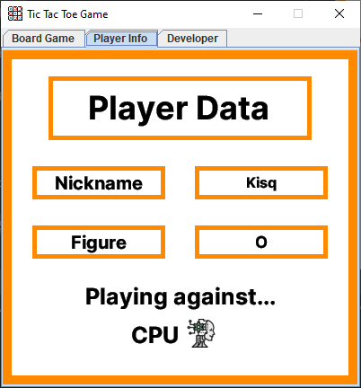

# Tic Tac Toe Game
***
Welcome to the Tic Tac Toe Game! This is a single player game where you play against the computer. The game is played on a 3x3 grid. The goal of the game is to get three in a row. You can get three in a row vertically, horizontally, or diagonally. The game ends when either you or the computer gets three in a row or when the board is full. If the board is full and neither you nor the computer has three in a row, then the game is a tie.

The game was created with Java.

## Folder Structure
***
The workspace contains the following folders:
- `lib` : The folder to maintain dependencies.
- `bin`: The folder to maintain compiled files.
- `data` : The folder to maintain data files.
- `src`: The folder to maintain sources.

Inside the `src` folder, there are four packages:
- `model` : The package to maintain the model classes.
- `presenter` : This package contains the runnable class and a Constants class, that class contains most of the messages, and other variables that were used in the project.
- `view` : This package contains all the classes that are related to the user interface, being `HomeScreen.java` the one that manages the other classes in this package.
- `tools` : This package contains the classes that are used to manage the data files (Write and Read files).

## How to run the game
***
To run the game, you need to follow the next steps:

1. Open `src` folder.
2. Open `presenter` package.
3. Open `Presenter.java` class and run it.

## What you will see?
***
When you run the game, you will see the next screen:

As you can see, you have two buttons...

- **History**: This button will take you to the all-time history of the game. For example, you will see the next screen:

**IMPORTANT**

This image is only to give an example of how the **history screen** would look like, the content of it will depend on the users who play the game.

**Where does the data shown in the table come from?**

The data shown in the table comes from the `data` folder, specifically from the `game_history.txt` file. This file is the one that contains the data of the history of the game.

**NOTE THAT...**

The first time you run the application, there will be one register in the `game_history.txt` file, in order to show you how a register would look like in the table. Feel free to delete that register or even the file, the application will create it again when you run it.

***
If you want to get back to the home screen, you just need to click on the **Menu** button.
***
Once you are in the home screen, the other button that you can see is the **Play** button. If you click on it, you will see the next screen:

In this screen, you need to enter your name and choose the figure you want to play with.

**NOTE THAT...**

You can't leave the nickname field empty. If you do it, you will see the next message in your screen:

***
In that screen, you can see two buttons:

- **Back**: This button will take you to the home screen.
- **Start**: This button will take you to the game screen.

***
Once you are in the game screen, you will see the next screen:

As you can see, the screen has three tabs, the **Board Game** tab is the one that you just saw. In this tab, you will see the board game and two labels that will show you the name of the player and his selected figure and the name of the computer and its assigned figure.

**IMPORTANT**

Depending on the outcome of the game (Win, Lose or Tie), you will see a popup with a message that will tell you the outcome of the game and two buttons. For example, if you win, you will see the next popup:

In that popup, you can see two buttons:

- **Menu**: This button will take you to the home screen, giving you the option of playing again or check the game historical.
- **Ok**: This button will just fade the popup and let you explore the other existing tabs.

***
The other tab that you can see is the **Player Info** tab. In this tab, you will see the player info registered. For example, you will see the next screen:

In that tab, you can see the **Nickname** and **Figure** of the player. Also, you can see the mini label that tell you that the player is playing against the computer.

***
The last tab that you can see is the **Developer** tab. In this tab, you will see the **information** of who developed the game **(me :D)**. For instance, you will see the next screen:

***
## IMPORTANT

- All game data is stored in the `data` folder. If you want to check the data, you can open the `game_history.txt` file.
- Let's suppose that you finish a game and in the popup you click on the **Ok** button in order to check the other tabs... Well, if you want to play again, just close the frame and run the game again, the game data will be there anyway.

**That's all! I hope you enjoy the game! :)**

***
## Author

Jaider Leonardo Castellanos Peña

- **Email**: jaider.castellanos@uptc.edu.co
